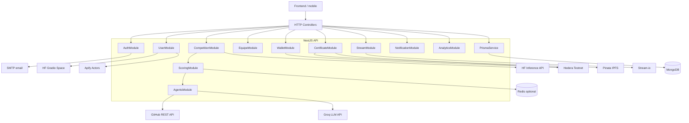
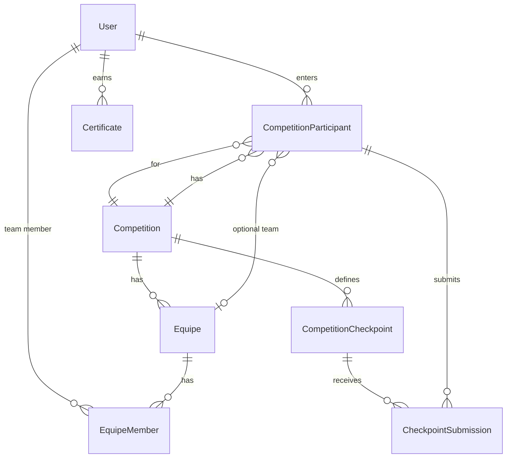
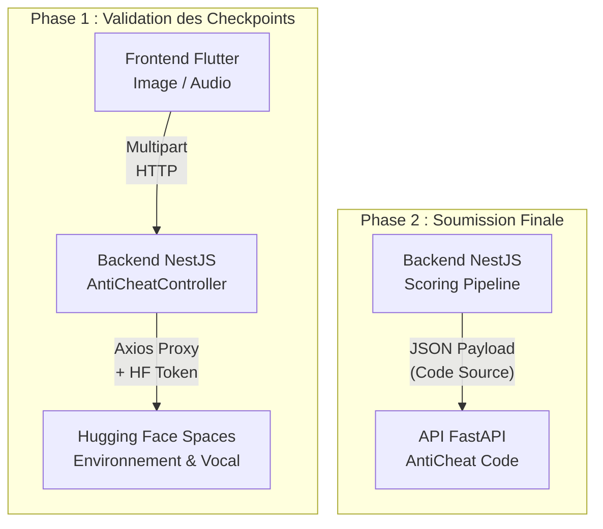
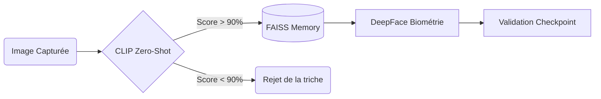
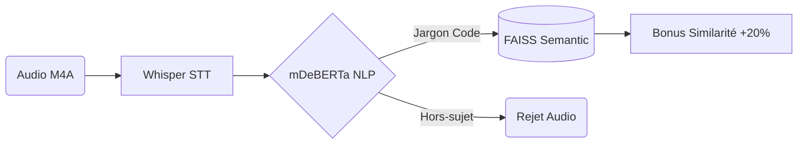
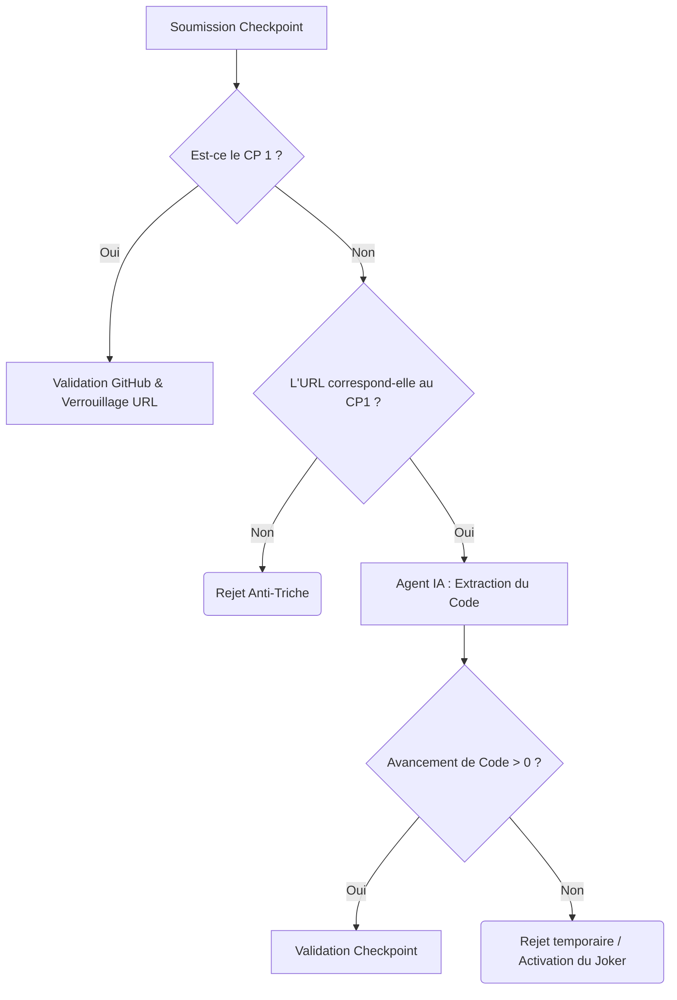
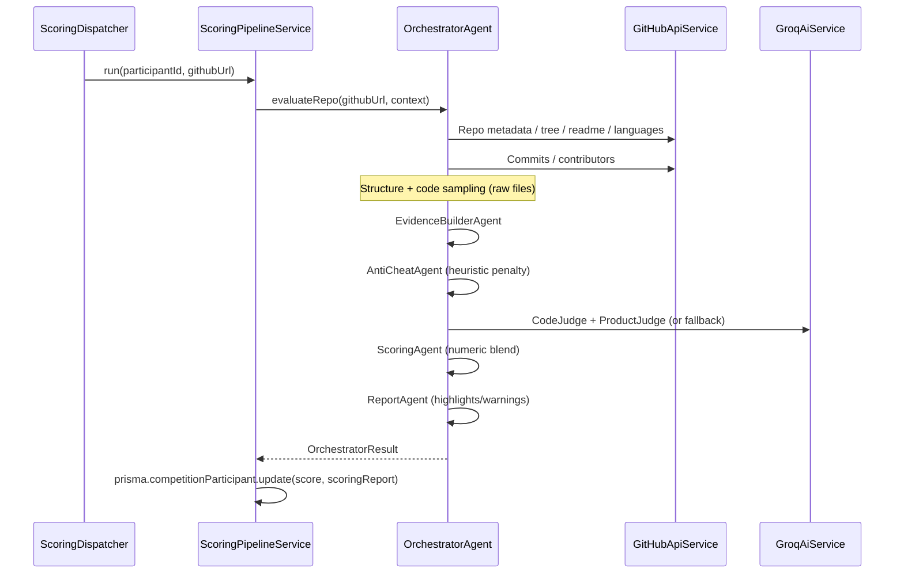
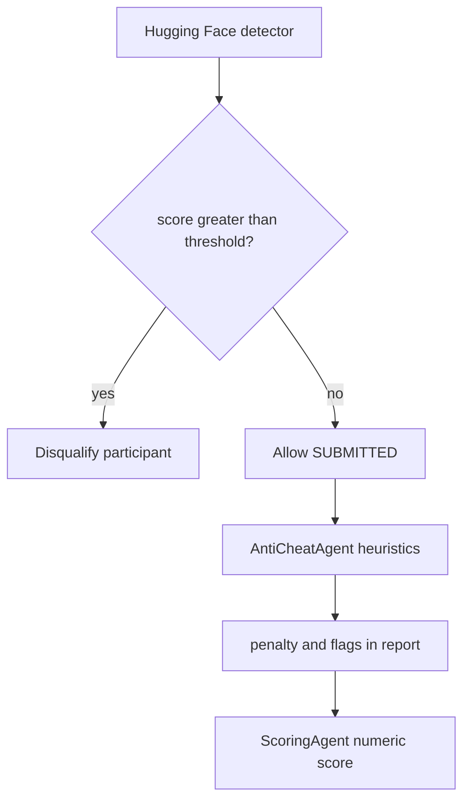

# Arena of Coders — Full Technical Documentation

This document describes the **arenabackend** NestJS application: architecture, data model, AI/automation flows, integrations, and operational behavior. It is derived from the current codebase (not from marketing copy alone).

### Viewing diagrams

- **Cursor / VS Code default preview** does not render Mermaid; fenced ` ```mermaid ` blocks look like plain code. Install an extension such as [**Markdown Preview Mermaid Support**](https://marketplace.visualstudio.com/items?itemName=bierner.markdown-mermaid) (or open the file on **GitHub**, which renders Mermaid in `.md` files).
- **ASCII diagrams** are included below several sections so the flows are readable even without Mermaid.

---

## 1. Purpose and product slice

The backend powers **Arena of Coders**: hackathons/competitions, team formation (**Equipe**), GitHub submissions, automated **repository scoring** via an agent pipeline, optional **AI-generated code detection** for disqualification, **user profiles** enriched with CV parsing and social scraping, **live chat/video** via Stream, **Hedera**-based **Arena Coin** and **certificate NFTs**, and admin/analytics surfaces.

---

## 2. High-level architecture

**ASCII (works in any Markdown preview):**

```
                    ┌─────────────────┐
                    │ Frontend mobile │
                    └────────┬────────┘
                             │ HTTP
                             ▼
┌──────────────────────────────────────────────────────────────────┐
│                     NestJS API (controllers)                      │
│  Auth · User · Competition · Equipe · Scoring · Agents · Wallet  │
│  Certificate · Stream · Notification · Analytics · Prisma          │
└─────┬───────────────────────────────────────────────┬────────────┘
      │                                                │
      │ Prisma                                         │ optional queue
      ▼                                                ▼
┌─────────────┐                                  ┌─────────┐
│  MongoDB    │                                  │  Redis  │
└─────────────┘                                  └─────────┘

External: GitHub API · Groq · HF Inference · HF Gradio · Apify · Stream.io
          · Hedera · Pinata · SMTP
```

**Mermaid** (GitHub / Mermaid-enabled preview only):



---

## 3. Technology stack

| Area | Choice |
|------|--------|
| Runtime / language | Node.js, TypeScript |
| Framework | NestJS 11 |
| Database | MongoDB via Prisma 6 |
| Auth | JWT (Passport JWT), bcrypt |
| Validation | `class-validator`, `class-transformer`, global `ValidationPipe` |
| API docs | Swagger UI at `/api` |
| Background jobs | BullMQ + Redis (optional; scoring queue) |
| Resilience | `fetchWithTimeout`, `opossum` circuit breaker (Hugging Face inference) |
| Blockchain | `@hashgraph/sdk` (testnet), fungible Arena Coin + NFT certificates |
| CV / ML client | `@gradio/client` (dynamic ESM import) |

---

## 4. Application bootstrap and HTTP surface

- **Entry**: `src/main.ts` imports `bootstrap-env` first so `.env` is loaded before dynamic modules (e.g. Bull) read `process.env`.
- **CORS**: If `FRONTEND_URL` is set (comma-separated origins), CORS is restricted to those origins with credentials; otherwise CORS is wide open.
- **Static files**: `./uploads` is served under `/uploads/` (avatars, uploads).
- **Global validation**: `whitelist: true`, `forbidNonWhitelisted: true`, `transform: true`.
- **Trust proxy**: `TRUST_PROXY=1` enables `trust proxy` for correct client IP behind proxies (used by throttlers).
- **Listen**: `0.0.0.0:PORT` (default **3000**).

Root module imports: `ConfigModule`, `ThrottlerModule`, `ScheduleModule`, `PrismaModule`, `ScraperModule`, `AuthModule`, `UserModule`, `StreamModule`, `AdminModule`, `CompetitionModule`, `NotificationModule`, `CertificateModule`, `WalletModule`, `AntiCheatModule`, `AnalyticsModule`, `EquipeModule`.

---

## 5. Database model (Prisma / MongoDB)

Key enums: `UserRole` (USER, ADMIN, COMPANY), `Specialty`, `CompetitionStatus`, `ParticipantStatus`, `CheckpointStatus`, `EquipeStatus`, transaction types for Arena Coin.

**User**: auth fields, profile, **CV URL**, **mainSpecialty** and **skillTags** (AI + enrichment), **githubUrl** / **linkedinUrl**, optional **linkedinPosts** / **githubRepos** JSON, **walletBalance**, **hederaAccountId**, **fcmToken**, stats (`totalChallenges`, `totalWins`), ban fields.

**Competition**: title, description, difficulty, specialty, dates, **status**, **rewardPool**, **antiCheatEnabled**, **antiCheatThreshold**, **topN**, checkpoints, equipes.

**CompetitionParticipant**: unique `(competitionId, userId)`, optional **equipeId**, **hackathonFaceUrl**, **githubUrl**, **antiCheatScore**, **score**, **scoringReport** (JSON from pipeline), **submittedAt**, **isWinner**.

**Equipe**: per-competition team; **githubUrl**, **score**, **scoringReport**, **antiCheatScore**, **submittedAt** at team level; members and invitations.

**CheckpointSubmission**: proof URL, notes, status, per checkpoint + participant.

**Certificate**: Hedera NFT metadata — **tokenId**, **serial**, IPFS URLs, optional transfer tracking.

**TransactionLog**: Hedera-aligned audit trail for Arena Coin (mint, escrow, reward, refund).

**CompanyRoleRequest**, **EmailVerification**, **PasswordReset**, **Notification** support ancillary flows.

**Entity relationships (text):**

```
User ──< CompetitionParticipant >── Competition
User ──< EquipeMember >── Equipe ──< Competition
Competition ──< CompetitionCheckpoint ──< CheckpointSubmission >── CompetitionParticipant
User ──< Certificate
```



---

## 6. AI and ML-related systems

The project uses several **external models and automation layers**. They serve different purposes.

### 6.1 Groq LLM (hackathon judging)

- **Service**: `GroqAiService` → `https://api.groq.com/openai/v1/chat/completions`.
- **Config**: `GROQ_API_KEY` (required for AI path); `GROQ_MODEL` (default `llama-3.3-70b-versatile`); `GROQ_HTTP_TIMEOUT_MS` (default 90s).
- **Contract**: `askForJson<T>()` forces `response_format: json_object`, temperature **0.2**, parses assistant content as JSON.
- **Consumers**:
  - **CodeJudgeAgent**: scores **complexity**, **codeQuality**, **architecture** (0–10 each) from serialized **Evidence** (including code samples). If `competitionTopic` is set (from competition **description**), the prompt insists the model verify the **code** matches the topic, not just the README.
  - **ProductJudgeAgent**: scores **innovation**, **impact**, **usability** (0–10) with similar topic alignment instructions.
- **Fallback**: If no API key or the call fails, both judges use **heuristic** scores derived from file counts, tests, README presence, structure flags.

### 6.2 Hugging Face — AI-text detector (submission gate)

- **Service**: `AntiCheatService.analyzeRepository(githubUrl)`.
- **Model**: `roberta-base-openai-detector` via Hugging Face Inference API.
- **Input**: README raw content fetched from GitHub (truncated ~2000 chars).
- **Output**: Interprets **Fake** / `LABEL_1` probability → integer **0–100** (“% AI-generated” style score).
- **Circuit breaker**: `opossum` with configurable timeouts and thresholds (`HUGGINGFACE_*` env vars).
- **Fallback**: Deterministic **mock** score from URL hash if token missing or errors.
- **Policy** (in `CompetitionService.submitWork`): If `competition.antiCheatEnabled` and score **>** `antiCheatThreshold`, participant is **DISQUALIFIED** (not the scoring pipeline penalty).

### 6.3 Hugging Face Gradio — CV extraction

- **Service**: `CvExtractionService.extractFromBuffer`.
- **Space**: `kaaboura/cv-extraction-prediction`, endpoint `/predict_cv`.
- **Input**: `.docx` buffer; optional `HUGGINGFACE_TOKEN` for private space; `CV_EXTRACTION_API_KEY` passed as Gradio `api_key` parameter.
- **Output**: Normalized **prediction** string → mapped to Prisma `Specialty` where possible; **skill** list capped (length and count limits).
- **Signup**: `AuthService.signUp` calls CV extraction after user creation; failures are swallowed so signup still succeeds.

### 6.4 Heuristic “anti-cheat” in the scoring pipeline (not HF)

- **AntiCheatAgent** inspects **Evidence** only (commits, file count, contributors, tests, sample count) and produces a **penalty** sum and **flags**. This is separate from Hugging Face disqualification.

### 6.5 Apify (not an LLM; data enrichment)

- **ApifyService**: LinkedIn profile skills, LinkedIn posts, GitHub repo scrapes via configured **Actors** (`APIFY_API_TOKEN`, sync timeout ~60s).
- Used during signup / profile enrichment to merge into **skillTags** and JSON profile fields.

### 6.6 Écosystème IA : Validation des Checkpoints et Anti-Triche Finale (Hugging Face)

Afin de garantir l'intégrité du hackathon de bout en bout, l'application intègre un **écosystème de trois modèles d'Intelligence Artificielle** intervenant à deux étapes clés de la compétition : la validation intermédiaire des **Checkpoints** (Environnement et Vocal) et l'évaluation de la **Soumission Finale** (AntiCheat de code). 

Contrairement à des scripts locaux simples, ces modèles sont déployés en tant que micro-services robustes sur **Hugging Face Spaces (via FastAPI)**. Le backend NestJS agit comme un **Proxy Sécurisé** (API Gateway) pour le frontend Flutter, protégeant ainsi les tokens d'accès et centralisant la logique métier.

**Architecture d'Intégration (ASCII)** :
```text
[ PHASES DU HACKATHON ]

1. PHASE DES CHECKPOINTS (Intermédiaire)
 ┌─────────┐ multipart  ┌────────────────┐ proxy + token  ┌──────────────────────┐
 │ Flutter ├───────────►│ NestJS Backend ├───────────────►│ Hugging Face Spaces  │
 │ (Mobile)│ image/audio│ (AntiCheatCtrl)│                │ - Check Environnement│
 └─────────┘            └────────────────┘                │ - Check Vocal        │
                                                          └──────────────────────┘

2. PHASE DE SOUMISSION FINALE (Code)
                        ┌────────────────┐ payload JSON   ┌──────────────────────┐
                        │ NestJS Backend ├───────────────►│ API FastAPI ML       │
                        │ (Scoring Pipe) │                │ - AntiCheat Code     │
                        └────────────────┘                └──────────────────────┘
```

**Architecture d'Intégration (Mermaid)** :


#### 📸 1. Modèle Check Envirement (Validation Visuelle de l'Espace de Travail)

> **🎯 Le Besoin Métier** : S'assurer que le participant est bien devant son ordinateur, en train de coder, et qu'il n'utilise pas de méthodes de triche visuelle (photo d'un autre écran, images d'illustration trouvées sur internet, ou usurpation d'identité).

**⚙️ Architecture Technique & Innovation**
| Composant | Technologie | Rôle |
| :--- | :--- | :--- |
| **Vision Zero-Shot** | `Hugging Face CLIP` | Classification extrêmement rapide (512-dim) de l'environnement de travail. |
| **Biométrie** | `DeepFace` (VGG-Face) | Croisement facial entre la photo prise et l'avatar de référence du candidat. |
| **Mémoire Active** | `FAISS` (IndexFlatL2) | **Innovation** : Mémorise les environnements valides pour accorder un bonus adaptatif (+20%). |

**🔄 Flux de Traitement Interne**


#### 🎙️ 2. Modèle Check Vocal (Analyse de la Cohérence Sémantique Audio)

> **🎯 Le Besoin Métier** : Empêcher un candidat de soumettre du code sans le comprendre. L'IA vérifie s'il explique réellement son travail algorithmique ou s'il s'agit de bruits de fond/hors-sujet.

**⚙️ Architecture Technique & Innovation**
| Composant | Technologie | Rôle |
| :--- | :--- | :--- |
| **Speech-to-Text** | `Whisper-tiny` | Retranscription multilingue de l'audio envoyé par le candidat (support 16kHz). |
| **NLP Zero-Shot** | `mDeBERTa-v3` | Classification sémantique du texte (Technique vs Loisir/Bruit). |
| **Mémoire Sémantique** | `sentence-transformers` + `FAISS` | **Innovation** : Encodage (384-dim) pour comparer avec le jargon validé (bonus +20%). |

**🔄 Flux de Traitement Interne**


#### 🕵️‍♂️ 3. Modèle AntiCheat (Évaluation Avancée du Code Source)

> **🎯 Le Besoin Métier** : Intercepter les dépôts GitHub contenant du code généré massivement par IA, plagié sur d'autres projets, ou simplement copié-collé sans effort de logique.

**⚙️ Architecture Technique & Innovation**
| Composant | Technologie | Rôle |
| :--- | :--- | :--- |
| **Machine Learning** | `RandomForestClassifier` | Évaluation de la probabilité IA basée sur la complexité et la variance d'indentation. |
| **Détection Plagiat** | `TF-IDF` + `Cosine Similarity` | Analyse comparative des textes pour détecter le copier-coller parfait ou partiel. |
| **Human-in-the-loop** | `FastAPI` (Cycles manuels) | **Innovation** : Apprentissage actif via les décisions humaines (`human_decisions.jsonl`). |

**📊 Formule de Scoring Mathématique :**  
`FinalScore = 0.4 * score_ia + 0.3 * score_plagiat + 0.3 * score_copy_paste`

#### ⏳ 4. Modèle d'Avancement Temporel & Sécurité des Dépôts (Checkpoints)

> **🎯 Le Besoin Métier** : S'assurer que les participants travaillent sur un seul et même projet tout au long du hackathon et qu'ils produisent *réellement* du code entre deux checkpoints, empêchant ainsi la soumission de dépôts "coquilles vides" ou de projets pré-existants.

**⚙️ Architecture Technique & Innovation**
| Composant | Rôle & Mécanique |
| :--- | :--- |
| **Verrouillage de Dépôt (CP1)** | Lors du 1er checkpoint, le backend valide que le lien GitHub existe et est public. Il "verrouille" cette URL de base (`baseRepositoryUrl`). Pour les checkpoints suivants (CP2, CP3...), toute soumission avec un lien différent est automatiquement rejetée (Sécurité Anti-Changement de projet). |
| **Analyse d'Avancement (CP > 1)** | L'orchestrateur NestJS utilise un Agent IA pour extraire l'arborescence du code. Le système calcule la progression mathématique : `Nouveaux Fichiers = Fichiers Actuels - Fichiers CP Précédent`. Si ce delta est `<= 0`, le checkpoint est refusé car l'équipe n'a rien codé. |
| **Système "Joker" (Grace Period)** | **Innovation** : L'approche n'est pas purement punitive. Si un participant échoue à démontrer un avancement, le système gère une machine à états (State Machine) qui lui accorde un joker (Extra Life) temporel pour corriger son repo avant la disqualification définitive. |

**🔄 Flux de Traitement Interne (NestJS)**


---

## 7. Agent scoring pipeline (orchestrator)

The **OrchestratorAgent** runs a **linear** pipeline and reports progress **10 → 100** in steps of 10 for optional Bull/job callbacks.

**Pipeline order (text):**

```
ScoringDispatcher → ScoringPipelineService.run()
  → OrchestratorAgent.evaluateRepo()
      → GitHub: repo / tree / readme / languages / commits / contributors
      → Structure + code sampling
      → EvidenceBuilderAgent → AntiCheatAgent → Groq judges → ScoringAgent → ReportAgent
  → prisma.competitionParticipant.update(score, scoringReport)
```



### 7.1 Agent responsibilities

| Agent | Input | Output |
|-------|--------|--------|
| **RepoExtractorAgent** | GitHub URL string | `RepoMetadata` (readme, recursive tree, languages, counts, dates) |
| **RepoActivityAgent** | `RepoMetadata` | Approx. commit count (Link header), contributor count, last commit |
| **StructureAnalysisAgent** | `RepoMetadata` | Backend/frontend/tests/CI flags, config files, `architectureQuality` 1–5 |
| **CodeSamplerAgent** | `RepoMetadata` | Up to 8 code files: entry/API/component/heuristic “largest”, snippets truncated |
| **EvidenceBuilderAgent** | Repo + activity + structure + samples | `Evidence` (stack tags, deps from readme+paths, readme summary) |
| **AntiCheatAgent** | `Evidence` | `penalty`, `flags`, `suspicious` |
| **CodeJudgeAgent** | `Evidence` | Groq or fallback **CodeJudgeScore** |
| **ProductJudgeAgent** | `Evidence` | Groq or fallback **ProductJudgeScore** |
| **ScoringAgent** | Code + product scores + anti-cheat | `finalScore`, `breakdown` |
| **ReportAgent** | Evidence + flags + score | Human-readable **title/summary/highlights/warnings** |

### 7.2 Final score formula (`ScoringAgent`)

All judge dimensions are on **0–10**; the service computes weighted contributions, then scales to **0–100**:

- `complexityWeighted = complexity × 0.3`
- `innovationWeighted = innovation × 0.25`
- `impactWeighted = impact × 0.2`
- `qualityWeighted = codeQuality × 0.25`

`rawBeforePenalty` = sum of the four.  
`finalScore` = `clamp(rawBeforePenalty × 10, 0, 100)` (two decimal places in code).

**Important implementation notes** (for maintainers):

1. **`architecture`** from **CodeJudge** is **not** part of this weighted sum (only **codeQuality** and **complexity** from the code judge are used).
2. **`antiCheat.penalty`** is stored in `breakdown.penalty` but **not subtracted** from `finalScore` in `ScoringAgent`; heuristic penalty is informational unless you change that logic.

### 7.3 Persistence (`ScoringPipelineService`)

After a successful run, `competitionParticipant` is updated with:

- `score`: `finalScore`
- `scoringReport`: JSON with codeJudge, productJudge, antiCheat, report text fields, and `breakdown`

**Competition topic** passed to Groq is `competition.description` from the DB.

---

## 8. Scoring dispatch (sync vs queue)

- **Module**: `ScoringModule.register()` — if `QUEUE_SCORING_ENABLED === 'true'`, registers **BullMQ** with Redis (`REDIS_HOST`, `REDIS_PORT`, `REDIS_PASSWORD`), **`ScoringQueueProcessor`**, and **Bull Board** at `/queues`.
- **ScoringDispatcherService.dispatchAfterSubmit**: After a successful GitHub submit HTTP handler, either enqueues a job (`scoring-{participantId}`) or **fire-and-forgets** `pipeline.run()` inline. Duplicate job IDs are ignored; enqueue failures fall back to inline.

Worker concurrency: `SCORING_WORKER_CONCURRENCY` (default **2**).

---

## 9. Competition and submission flows

### 9.1 Work submission (`submitWork`)

- Competition must be **RUNNING**.
- Final GitHub submission window: opens **20 minutes before** `endDate` (French locale message for opening time).
- User must be registered; if in an **Equipe**, only **LEADER** may submit; team cannot double-submit.
- **Anti-cheat path** (if enabled): Hugging Face score vs threshold → disqualify or accept; on accept, updates participant (+ team transactionally if needed), then **dispatch scoring**.
- **Without anti-cheat**: marks **SUBMITTED**, dispatches scoring similarly.

### 9.2 Checkpoints

- Separate **checkpoint** submit flow with time windows (`CHECKPOINT_SUBMISSION_WINDOW_MINUTES` referenced in service), status transitions, and cron-driven **missed** checkpoint handling (disqualification after **≥ 3** failures — see `CompetitionService`).

### 9.3 Rate limiting (`ThrottlerModule`)

- **`submit`**: TTL/limit from `RATE_LIMIT_SUBMIT_TTL_MS`, `RATE_LIMIT_SUBMIT_LIMIT` — keyed by user id or IP.
- **`checkpoint`**: `RATE_LIMIT_CHECKPOINT_TTL_MS`, `RATE_LIMIT_CHECKPOINT_LIMIT`.

Error message: French **“Trop de requêtes…”**.

---

## 10. Authentication and user lifecycle

- **JWT**: `JWT_SECRET`, `JWT_EXPIRES_IN` (default 7d); strategy in `jwt.strategy.ts`.
- **Sign up**: hashes password (bcrypt rounds **12**), stores user; optional **avatar** to `uploads/avatars`; **CV** buffer → Gradio extraction; **LinkedIn** → Apify skills merge; additional flows in `AuthService` (GitHub scraping via `ScraperService`, Stream membership hooks — see full file).
- **Email**: `EmailModule` uses SMTP config (e.g. `SMTP_USER`, `SMTP_PASSWORD` — prefer env-only in production).
- **Guards**: `JwtAuthGuard`, `RolesGuard`, `AdminGuard` on admin routes.

---

## 11. Stream (chat / video)

- **StreamService**: `StreamClient` when `STREAM_API_KEY` / `STREAM_API_SECRET` set.
- **Tokens**: `createUserToken` with clock-skew handling (iat in the past).
- **Channels**: `ensureArenaMember` (arena-live), `ensureRoomMember` (sanitized room id), **team channels** helpers for Equipe/competition (see remainder of `stream.service.ts`).

---

## 12. Wallet and Hedera

- **WalletService**: Hedera **testnet** client from `HEDERA_ACCOUNT_ID` / `HEDERA_PRIVATE_KEY`. Arena Coin fungible token id `ARENA_COIN_TOKEN_ID`, decimals from `ARENA_COIN_DECIMALS`. Operations include admin mint to company, escrow/reward flows, `TransactionLog` rows, mirror API helpers (`HEDERA_MIRROR_BASE_URL`).
- **CertificateService**: Renders certificate image (**sharp**), uploads to **Pinata** (`PINATA_API_KEY`, `PINATA_SECRET_API_KEY`), builds NFT metadata, mints NFT on Hedera, optionally transfers to user `hederaAccountId`.

---

## 13. Other modules (concise)

| Module | Role |
|--------|------|
| **AdminModule** | Admin operations; may call **n8n** webhook (`N8N_WEBHOOK_URL` / test URL) for emails |
| **AnalyticsModule** | Aggregates developers with scores, wins, filters |
| **NotificationModule** | CRUD-style read/mark read for `Notification` |
| **ScraperModule** | GitHub user/repo enrichment (`GITHUB_TOKEN` optional) |
| **EquipeModule** | Team creation, invites, leader rules; integrates with competition/stream |
| **PasswordReset / EmailVerification** | Code-based flows (models in Prisma) |
| **AntiCheatModule** | Exposes service + controller patterns (HF token check in controller) |

---

## 14. Environment variables (reference)

Below are variables **referenced in code** (non-exhaustive of `.env`; do not commit secrets).

| Variable | Used for |
|----------|-----------|
| `DATABASE_URL` | MongoDB |
| `JWT_SECRET`, `JWT_EXPIRES_IN` | Auth |
| `PORT`, `FRONTEND_URL`, `TRUST_PROXY` | HTTP |
| `GITHUB_TOKEN`, `GITHUB_HTTP_TIMEOUT_MS` | GitHub API for agents/scraper |
| `GROQ_API_KEY`, `GROQ_MODEL`, `GROQ_HTTP_TIMEOUT_MS` | LLM judging |
| `HUGGINGFACE_TOKEN` | HF inference + Gradio + anti-cheat |
| `HUGGINGFACE_HTTP_TIMEOUT_MS`, `HUGGINGFACE_CB_*` | Anti-cheat circuit breaker |
| `CV_EXTRACTION_API_KEY` | Gradio CV space |
| `APIFY_API_TOKEN` | LinkedIn/GitHub actors |
| `STREAM_API_KEY`, `STREAM_API_SECRET` | Stream.io |
| `SMTP_USER`, `SMTP_PASSWORD` | Email |
| `QUEUE_SCORING_ENABLED`, `REDIS_*`, `SCORING_*` | BullMQ scoring |
| `RATE_LIMIT_*` | Throttling |
| `HEDERA_ACCOUNT_ID`, `HEDERA_PRIVATE_KEY`, `ARENA_COIN_TOKEN_ID`, `ARENA_COIN_DECIMALS`, `HEDERA_MIRROR_BASE_URL` | Wallet / ledger |
| `PINATA_API_KEY`, `PINATA_SECRET_API_KEY` | Certificate IPFS |
| `N8N_WEBHOOK_URL`, `N8N_WEBHOOK_TEST_URL` | Admin automation |

`docker-compose.yml` provides local **Redis** only.

---

## 15. Repository layout (src)

- **`agents/`** — GitHub integration, Groq, full orchestrated pipeline types (`agents.types.ts`).
- **`scoring/`** — Pipeline persistence, dispatcher, Bull processor.
- **`competition/`** — Lifecycle, submit, checkpoints, winner logic, leaderboards.
- **`equipe/`** — Teams.
- **`anti-cheat/`** — HF inference service for submit gate.
- **`cv-extraction/`** — Gradio CV.
- **`apify/`**, **`scraper/`** — Profile enrichment.
- **`stream/`** — Stream.io + room config.
- **`wallet/`**, **`certificate/`** — Hedera + Pinata.
- **`auth/`**, **`user/`**, **`admin/`**, **`email/`**, **`notification/`**, **`analytics/`**.
- **`prisma/`**, **`common/`** — DB client, Hedera helpers, `fetchWithTimeout`.

Root **utility scripts** (`create-*-hackathon.ts`, `fix-checkpoints.ts`, etc.) are one-off maintenance/seed helpers, not part of the runtime server.

---

## 16. Mental model: two different “anti-cheat” concepts

**ASCII (works in any Markdown preview):**

```
ON GITHUB SUBMIT (if antiCheat enabled)
──────────────────────────────────────
  Hugging Face detector (README → score 0–100)
           │
           ├─ score > threshold ──► DISQUALIFY participant
           │
           └─ score ≤ threshold ──► status SUBMITTED
                                         │
                                         ▼
ASYNC SCORING PIPELINE (separate system)
────────────────────────────────────────
  AntiCheatAgent (heuristic: commits, files, tests, …)
           │
           ▼
  penalty + flags stored in scoringReport
           │
           ▼
  ScoringAgent → final numeric score (penalty not subtracted in code today)
```

**Mermaid** (use TB instead of LR for wider renderer support; no nested subgraph edges to OK→Pipeline in some engines):



---

## 17. API discovery

Interactive OpenAPI: **`/api`** (Swagger). Controllers are annotated with `@nestjs/swagger`; JWT bearer **`access-token`** security scheme.

---

## 18. Testing and quality

- Jest unit tests: `*.spec.ts` (auth, user, competition anti-cheat, app controller).
- Commands: `npm run test`, `npm run test:e2e`, `npm run test:cov`.

---

*Generated to reflect the repository state as of the documentation authoring pass. For behavioral guarantees, always treat the source files as authoritative.*
